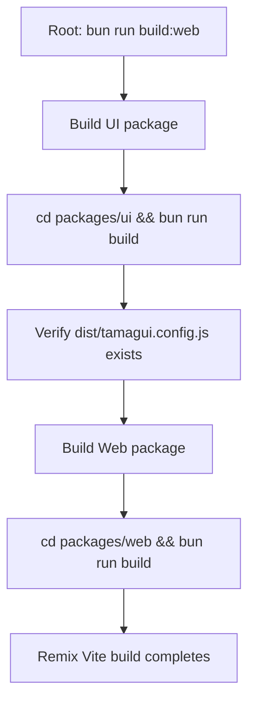

# Build Failure Investigation and Resolution Plan

## Executive Summary

The web package has two distinct build failures:

1. **TypeScript compilation error** - `react-router` module cannot be found in `auth.logout.tsx`
2. **SSR error** - Cannot find `tamagui.config` from the `@syncstuff/ui` package during vite:dev

---

## Issue 1: React Router Import Error

### Location
`packages/web/app/routes/auth.logout.tsx` at line 2

### Error Message
```
Module 'react-router' cannot be found
```

### Root Cause Analysis

The file imports `useNavigate` from `"react-router"`:

```tsx
import { useNavigate } from "react-router";
```

However, `react-router` is NOT listed as a dependency in `packages/web/package.json`. The project uses:

- `@remix-run/react` v2.17.3 - provides routing hooks including `useNavigate`
- `@react-router/cloudflare` v7.12.0 - React Router v7 integration for Cloudflare
- `@react-router/dev` v7.12.0 - React Router v7 dev tools

### Solution

Change the import to use `@remix-run/react` which is already installed and provides the `useNavigate` hook:

```diff
- import { useNavigate } from "react-router";
+ import { useNavigate } from "@remix-run/react";
```

### Files to Modify
- `packages/web/app/routes/auth.logout.tsx`

### Verification
```bash
cd packages/web && bun run typecheck
```

---

## Issue 2: SSR Tamagui Config Error

### Location
Vite SSR build for the web package

### Error Message
```
Cannot find module 'D:\repos\ionic\syncstuff\packages\ui\dist\tamagui.config'
```

### Root Cause Analysis

1. **The UI package builds correctly** - Running `bun run build` in `packages/ui` produces:
   - `dist/tamagui.config.js` ✓
   - `dist/tamagui.config.d.ts` ✓
   - All component files

2. **Package exports are correct** in `packages/ui/package.json`:
   ```json
   "./tamagui.config": {
     "types": "./dist/tamagui.config.d.ts",
     "default": "./dist/tamagui.config.js"
   }
   ```

3. **Build order problem** - The web package's prebuild script does not ensure the ui package is built first:
   ```json
   "prebuild": "bun run format && bun run lint:fix && bun run typecheck"
   ```

4. **TypeScript may fail** before the ui package can be built, preventing the dist files from existing.

### Solution

Add a build step for the ui package in the web package's prebuild script:

```json
"prebuild": "bun run build:ui && bun run format && bun run lint:fix && bun run typecheck"
```

### Additional Solution: Root-level Build Script

Ensure the root `build:web` script properly handles dependencies:

```bash
# Ensure ui is built before web
bun run build:ui && cd packages/web && bun run build
```

### Files to Modify
- `packages/web/package.json` (prebuild script)

### Verification
```bash
# Build ui package
cd packages/ui && bun run build

# Verify tamagui.config exists
ls dist/tamagui.config.js

# Build web package
cd ../web && bun run build
```

---

## Recommended Build Order



### Development Workflow

```bash
# Before running dev, ensure ui is built
bun run build:ui

# Then start web dev server
bun run web
```

---

## Step-by-Step Debugging Instructions

### For Issue 1: React Router Import

1. **Check installed dependencies:**
   ```bash
   cd packages/web && cat package.json | grep -A 50 "dependencies"
   ```

2. **Verify @remix-run/react is installed:**
   ```bash
   cd packages/web && ls node_modules/@remix-run/react
   ```

3. **Check the import statement in auth.logout.tsx:**
   ```bash
   cat packages/web/app/routes/auth.logout.tsx | head -5
   ```

4. **Run typecheck to see the error:**
   ```bash
   cd packages/web && bun run typecheck
   ```

### For Issue 2: SSR Tamagui Config

1. **Verify ui package build output exists:**
   ```bash
   ls packages/ui/dist/tamagui.config.js
   ```

2. **Rebuild ui package:**
   ```bash
   cd packages/ui && bun run build
   ```

3. **Check package.json exports:**
   ```bash
   cat packages/ui/package.json | grep -A 10 "exports"
   ```

4. **Verify web package can resolve the module:**
   ```bash
   cd packages/web && node -e "require('@syncstuff/ui/tamagui.config')"
   ```

5. **Check for circular dependencies:**
   ```bash
   cd packages/web && cat package.json | grep "@syncstuff"
   ```

---

## Prevention Strategies

1. **Add a root-level build script** that properly sequences builds:
   ```json
   "build:all": "bun run build:ui && bun run build:web && bun run build:api"
   ```

2. **Add dependency validation** to CI:
   ```bash
   # Ensure ui dist exists before building web
   test -f packages/ui/dist/tamagui.config.js || bun run build:ui
   ```

3. **Document the build order** in README.md or CLAUDE.md

---

## Files Modified

| File | Change |
|------|--------|
| `packages/web/app/routes/auth.logout.tsx` | Change import from `react-router` to `@remix-run/react` |
| `packages/web/package.json` | Add `build:ui` to prebuild script |

---

## Verification Commands

After applying fixes:

```bash
# 1. Build ui package
cd packages/ui && bun run build

# 2. Typecheck web package
cd ../web && bun run typecheck

# 3. Build web package
bun run build

# 4. Start dev server
bun run dev
```
